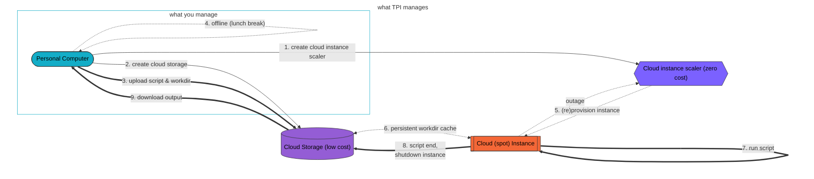

# Terraform Provider Iterative (TPI)

[](https://registry.terraform.io/providers/iterative/iterative/latest/docs)
[](https://github.com/iterative/terraform-provider-iterative/actions/workflows/test.yml)
[![Apache-2.0][licence-badge]][licence-file]

TPI is a [Terraform](https://terraform.io) plugin built with machine learning in mind. This CLI tool offers full lifecycle management of computing resources (including GPUs and respawning spot instances) from several cloud vendors (AWS, Azure, GCP, K8s)... without needing to be a cloud expert.

- **Lower cost with spot recovery**: transparent data checkpoint/restore & auto-respawning of low-cost spot/preemptible instances
- **No cloud vendor lock-in**: switch between clouds with just one line thanks to unified abstraction
- **No waste**: auto-cleanup unused resources (terminate compute instances upon task completion/failure & remove storage upon download of results), pay only for what you use
- **Developer-first experience**: one-command data sync & code execution with no external server, making the cloud feel like a laptop

Supported cloud vendors [include][auth]:

| [![Amazon Web Services (AWS)][aws-badge]][aws] | [![Microsoft Azure][azure-badge]][azure] | [![Google Cloud Platform (GCP)][gcp-badge]][gcp] | [![Kubernetes (K8s)][k8s-badge]][k8s] |
| ---------------------------------------------- | ---------------------------------------- | ------------------------------------------------ | ------------------------------------- |

[aws-badge]: https://img.shields.io/badge/AWS-Amazon_Web_Services-black?colorA=white&logoColor=232F3E&logo=amazonaws
[aws]: https://registry.terraform.io/providers/iterative/iterative/latest/docs/guides/authentication#amazon-web-services
[azure-badge]: https://img.shields.io/badge/Azure-Microsoft_Azure-black?colorA=white&logoColor=0078D4&logo=microsoftazure
[azure]: https://registry.terraform.io/providers/iterative/iterative/latest/docs/guides/authentication#microsoft-azure
[gcp-badge]: https://img.shields.io/badge/GCP-Google_Cloud_Platform-black?colorA=white&logoColor=4285F4&logo=googlecloud
[gcp]: https://registry.terraform.io/providers/iterative/iterative/latest/docs/guides/authentication#google-cloud-platform
[k8s-badge]: https://img.shields.io/badge/K8s-Kubernetes-black?colorA=white&logoColor=326CE5&logo=kubernetes
[k8s]: https://registry.terraform.io/providers/iterative/iterative/latest/docs/guides/authentication#kubernetes
[auth]: https://registry.terraform.io/providers/iterative/iterative/latest/docs/guides/authentication

<picture>
  <source media="(prefers-color-scheme: dark)" srcset="https://github.com/iterative/static/raw/main/img/tpi/high-level-dark.png">
  
</picture>

## Why TPI?

There are a several reasons to use TPI instead of other related solutions (custom scripts and/or cloud orchestrators):

1. **Reduced management overhead and infrastructure cost**:
   TPI is a CLI tool, not a running service. It requires no additional orchestrating machine (control plane/head nodes) to schedule/recover/terminate instances. Instead, TPI runs (spot) instances via cloud-native scaling groups[^scalers], taking care of recovery and termination automatically on the cloud provider's side. This design reduces management overhead & infrastructure costs. You can close your laptop while cloud tasks are running -- auto-recovery happens even if you are offline.
2. **Unified tool for data science and software development teams**:
   TPI provides consistent tooling for both data scientists and DevOps engineers, improving cross-team collaboration. This simplifies compute management to a single config file, and reduces time to deliver ML models into production.
3. **Reproducible, codified environments**:
   Store hardware requirements in a single configuration file alongside the rest of your ML pipeline code.

[^scalers]: [AWS Auto Scaling Groups](https://docs.aws.amazon.com/autoscaling/ec2/userguide/what-is-amazon-ec2-auto-scaling.html), [Azure VM Scale Sets](https://azure.microsoft.com/en-us/services/virtual-machine-scale-sets), [GCP managed instance groups](https://cloud.google.com/compute/docs/instance-groups#managed_instance_groups), and [Kubernetes Jobs](https://kubernetes.io/docs/concepts/workloads/controllers/job).

 TPI is used to power [CML](https://cml.dev), bringing cloud providers to existing GitHub, GitLab & Bitbucket CI/CD workflows ([repository](https://github.com/iterative/cml)).

## Usage

### Requirements

- [Install Terraform 1.0+](https://learn.hashicorp.com/tutorials/terraform/install-cli#install-terraform), e.g.:
  - Brew (Homebrew/Mac OS): `brew tap hashicorp/tap && brew install hashicorp/tap/terraform`
  - Choco (Chocolatey/Windows): `choco install terraform`
  - Conda (Anaconda): `conda install -c conda-forge terraform`
  - Debian (Ubuntu/Linux):
    ```
    sudo apt-get update && sudo apt-get install -y gnupg software-properties-common curl
    curl -fsSL https://apt.releases.hashicorp.com/gpg | sudo apt-key add -
    sudo apt-add-repository "deb [arch=amd64] https://apt.releases.hashicorp.com $(lsb_release -cs) main"
    sudo apt-get update && sudo apt-get install terraform
    ```
- Create an account with any supported cloud vendor and expose its [authentication credentials via environment variables][auth]

### Define a Task

In a project root directory, create a file named `main.tf` with the following contents:

```hcl
terraform {
  required_providers { iterative = { source = "iterative/iterative" } }
}
provider "iterative" {}

resource "iterative_task" "example" {
  cloud      = "aws" # or any of: gcp, az, k8s
  machine    = "m"   # medium. Or any of: l, xl, m+k80, xl+v100, ...
  spot       = 0     # auto-price. Default -1 to disable, or >0 for hourly USD limit
  disk_size  = -1    # GB. Default -1 for automatic

  storage {
    workdir = "."       # default blank (don't upload)
    output  = "results" # default blank (don't download). Relative to workdir
  }
  script = <<-END
    #!/bin/bash

    # create output directory if needed
    mkdir -p results
    # read last result (in case of spot/preemptible instance recovery)
    if test -f results/epoch.txt; then EPOCH="$(cat results/epoch.txt)"; fi
    EPOCH=$${EPOCH:-1}  # start from 1 if last result not found

    echo "(re)starting training loop from $EPOCH up to 1337 epochs"
    for epoch in $(seq $EPOCH 1337); do
      sleep 1
      echo "$epoch" | tee results/epoch.txt
    done
  END
}
```

See [the reference](https://registry.terraform.io/providers/iterative/iterative/latest/docs/resources/task#argument-reference) for the full list of options for `main.tf` -- including more information on [`machine` types](https://registry.terraform.io/providers/iterative/iterative/latest/docs/resources/task#machine-type) with and without GPUs.

[](https://youtu.be/2fEgO8SazSE)

Run this once (in the directory containing `main.tf`) to download the `required_providers`:

```
terraform init
export TF_LOG_PROVIDER=INFO
```

### Run Task

```
terraform apply
```

This launches a `machine` in the `cloud`, uploads `workdir`, and runs the `script`. Upon completion (or error), the `machine` is terminated.

With spot/preemptible instances (`spot >= 0`), auto-recovery logic and persistent (`disk_size`) storage will be used to relaunch interrupted tasks.

### Query Status

Results and logs are periodically synced to persistent cloud storage. To query this status and view logs:

```
terraform refresh
terraform show
```

### End Task

```
terraform destroy
```

This terminates the `machine` (if still running), downloads `output`, and removes the persistent `disk_size` storage.

## Example Projects

- [Run Jupyter & TensorBoard in the cloud with one command](https://github.com/iterative/blog-tpi-jupyter)
- [Move local ML experiments to the cloud](https://github.com/iterative/blog-tpi-bees)

## How it Works

This diagram may help to see what TPI does under-the-hood:



## Future Plans

TPI is a CLI tool bringing the power of bare-metal cloud to a bare-metal local laptop. We're working on more featureful and visual interfaces. We'd also like to have more native support for distributed (multi-instance) training, more data sync optimisations & options, and tighter ecosystem integration with tools such as [DVC](https://dvc.org). Plus of course more examples for Data Scientists and Machine Learning Engineers - from Jupyter, VSCode, and Codespaces to improving the live logging/monitoring/reporting experience.

## Help

The [getting started guide](https://registry.terraform.io/providers/iterative/iterative/latest/docs/guides/getting-started) has some more information. In case of errors, extra debugging information is available using `TF_LOG_PROVIDER=DEBUG` instead of `INFO`.

Feature requests and bugs can be [reported via GitHub issues](https://github.com/iterative/terraform-provider-iterative/issues), while general questions and feedback are very welcome on our active [Discord server](https://discord.gg/bzA6uY7).

## Contributing

Instead of using the latest stable release, a local copy of the repository must be used.

1. [Install Go 1.17+](https://golang.org/doc/install)
2. Clone the repository & build the provider
   ```
   git clone https://github.com/iterative/terraform-provider-iterative
   cd terraform-provider-iterative
   make install
   ```
3. Use `source = "github.com/iterative/iterative"` in your `main.tf` to use the local repository (`source = "iterative/iterative"` will download the latest release instead), and run `terraform init --upgrade`

## Copyright

This project and all contributions to it are distributed under [![Apache-2.0][licence-badge]][licence-file]

[licence-badge]: https://img.shields.io/badge/licence-Apache%202.0-blue
[licence-file]: https://github.com/iterative/terraform-provider-iterative/blob/main/LICENSE
