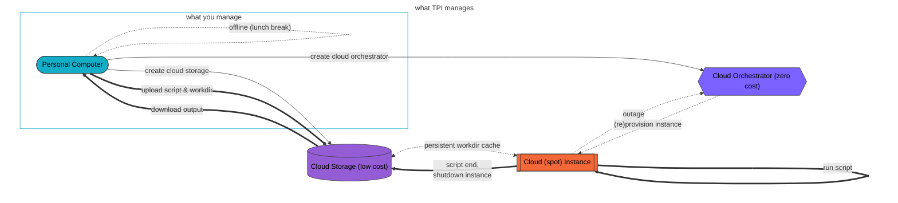

# Terraform Provider Iterative (TPI)

[](https://registry.terraform.io/providers/iterative/iterative/latest/docs)
[](https://github.com/iterative/terraform-provider-iterative/actions/workflows/test.yml)
[![Apache-2.0][licence-badge]][licence-file]

TPI is a [Terraform](https://terraform.io) plugin built with machine learning in mind. Full lifecycle management of computing resources (including GPUs and respawning spot instances) from several cloud vendors (AWS, Azure, GCP, K8s)... without needing to be a cloud expert.

- **Easy to use**: create cloud compute (CPU, GPU, RAM) & storage resources without reading pages of documentation
- **Low cost**: transparent auto-recovery from interrupted low-cost spot/preemptible instances
- **No cloud vendor lock-in**: switch between several cloud vendors with ease due to concise unified configuration
- **Seamless developer experience**: easily sync & run data & code in the cloud as easily as on a local laptop
- **No waste**: auto-cleanup unused resources (terminate compute instances upon job completion/failure & remove storage upon download of results)

Supported cloud vendors [include][auth]:

- Amazon Web Services (AWS)
- Microsoft Azure
- Google Cloud Platform (GCP)
- Kubernetes (K8s)

[auth]: https://registry.terraform.io/providers/iterative/iterative/latest/docs/guides/authentication

## Usage

### Requirements

- [Install Terraform 1.0+](https://learn.hashicorp.com/tutorials/terraform/install-cli#install-terraform), e.g.:
  - Brew (Homebrew/Mac OS): `brew tap hashicorp/tap && brew install hashicorp/tap/terraform`
  - Choco (Chocolatey/Windows): `choco install terraform`
  - Conda (Anaconda): `conda install -c conda-forge terraform`
  - Debian (Ubuntu/Linux):
    ```
    sudo apt-get update && sudo apt-get install -y gnupg software-properties-common curl
    curl -fsSL https://apt.releases.hashicorp.com/gpg | sudo apt-key add -
    sudo apt-add-repository "deb [arch=amd64] https://apt.releases.hashicorp.com $(lsb_release -cs) main"
    sudo apt-get update && sudo apt-get install terraform
    ```
- Create an account with any supported cloud vendor and expose its [authentication credentials via environment variables][auth]

### Define a Task

In a project root directory, create a file named `main.tf` with the following contents:

```hcl
terraform {
  required_providers { iterative = { source = "iterative/iterative" } }
}
provider "iterative" {}
resource "iterative_task" "example" {
  cloud      = "aws" # or any of: gcp, az, k8s
  machine    = "m"   # medium. Or any of: l, xl, m+k80, xl+v100, ...
  spot       = 0     # auto-price. Or -1 to disable, or >0 to set a hourly USD limit
  disk_size  = 30    # GB

  storage {
    workdir = "."
    output  = "results"
  }
  script = <<-END
    #!/bin/bash

    # create output directory if needed
    mkdir -p results
    # read last result (in case of spot/preemptible instance recovery)
    if [[ -f results/epoch.txt ]]; then EPOCH="$(cat results/epoch.txt)"; fi

    # (re)start training loop up to 42 epochs
    for epoch in $(seq ${EPOCH:-1} 42); do
      sleep 1
      echo "$epoch" > results/epoch.txt
    done
  END
}
```

See [the reference](https://registry.terraform.io/providers/iterative/iterative/latest/docs/resources/task#argument-reference) for the full list of options for `main.tf` -- including more information on [`machine` types](https://registry.terraform.io/providers/iterative/iterative/latest/docs/resources/task#machine-type) with and without GPUs.

Run this once (in the directory containing `main.tf`) to download the `required_providers`:

```
terraform init
```

### Run Task

```
TF_LOG_PROVIDER=INFO terraform apply
```

This launches a `machine` in the `cloud`, uploads `workdir`, and runs the `script`. Upon completion (or error), the `machine` is terminated.

With spot/preemptible instances (`spot >= 0`), auto-recovery logic and persistent storage will be used to relaunch interrupted tasks.

### Query Status

Results and logs are periodically synced to persistent cloud storage. To query this status and view logs:

```
TF_LOG_PROVIDER=INFO terraform refresh
TF_LOG_PROVIDER=INFO terraform show
```

### Stop Tasks

```
TF_LOG_PROVIDER=INFO terraform destroy
```

This terminates the `machine` (if still running), downloads `output`, and removes the persistent `disk_size` storage.

## Help

The [getting started guide](https://registry.terraform.io/providers/iterative/iterative/latest/docs/guides/getting-started) has some more information. In case of errors, extra debugging information is available using `TF_LOG_PROVIDER=DEBUG` instead of `INFO`.

Feature requests and bugs can be [reported via GitHub issues](https://github.com/iterative/terraform-provider-iterative/issues), while general questions and feedback are very welcome on our active [Discord server](https://discord.gg/bzA6uY7).

## How it Works

This diagram may also help to see what TPI does under-the-hood:



## Contributing

Instead of using the latest stable release, a local copy of the repository must be used.

1. [Install Go 1.17+](https://golang.org/doc/install)
2. Clone the repository & build the provider
   ```
   git clone https://github.com/iterative/terraform-provider-iterative
   cd terraform-provider-iterative
   make install
   ```
3. Use `source = "github.com/iterative/iterative"` in your `main.tf` to use the local repository (`source = "iterative/iterative"` will download the latest release instead), and run `terraform init --upgrade`

## Copyright

This project and all contributions to it are distributed under [![Apache-2.0][licence-badge]][licence-file]

[licence-badge]: https://img.shields.io/badge/licence-Apache%202.0-blue
[licence-file]: https://github.com/iterative/terraform-provider-iterative/blob/master/LICENSE
